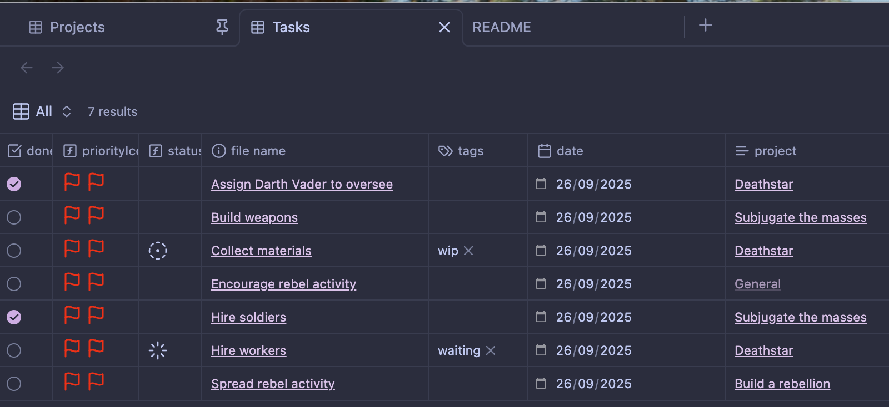

A minimal vault to manage tasks and projects in Obsidian, powered by Bases.

## Features
- Tasks link to projects
- Project files show related tasks
- Project base shows progress based on number of completed tasks
- Template support
	- Task and project template with auto-discovery of projects

## Hotkeys

| Key      | Command     |
| -------- | ----------- |
| Ctrl + t | New task    |
| Ctrl + p | New project |

## Screenshots

### Screenshots

### Tasks
